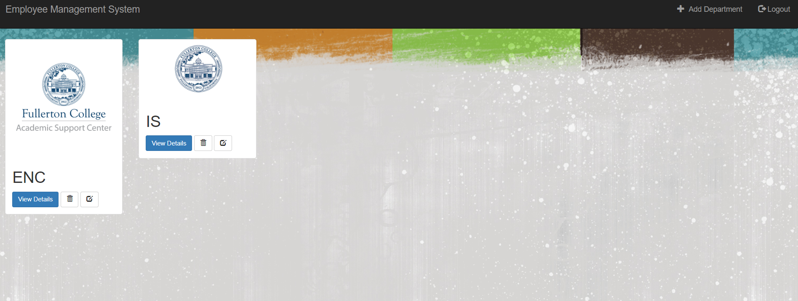
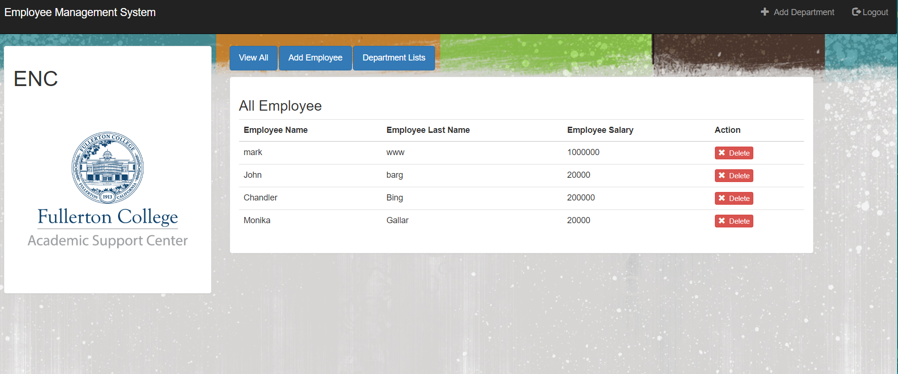
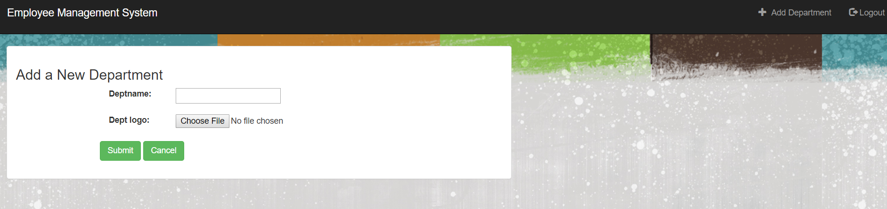
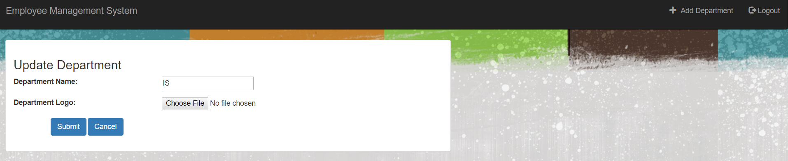
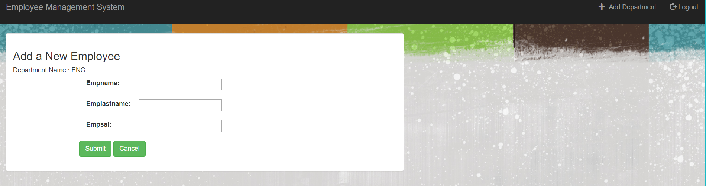

# Department_emp_project
Department &amp; Employee management application
Overview:
  This project has 2 features one is Department maintenance and other one is Employees maintenance. Department has list of employees. 
  Here we can add departments and employees. 
  
 Requirements:
  1. Virtual Environments
  2. Django 2.1
  3. Python 3.7.0
  4. SQLITE3
  
 Technologies used:
  1.Python
  2.Html
  3.CSS
  4.BootStrap
  
 Project Details:
    This project basically deals with maintenance of Department and Employees. Here we can upload department logo, uploded images will be 
    stored under project directory Media/documents.
    
 How to Use:
  - Activate the virtual Environment (env\Scripts\activate )
  - Run the django project ( python manage.py runserver )

  
 <h3>Login </h3>

<h3> List of Departments </h3>

<h3> List of Employees under each departments </h3>

<h3> Add Department </h3>

<h3> Update Department</h3>

<h3> Add Employee </h3>

  
